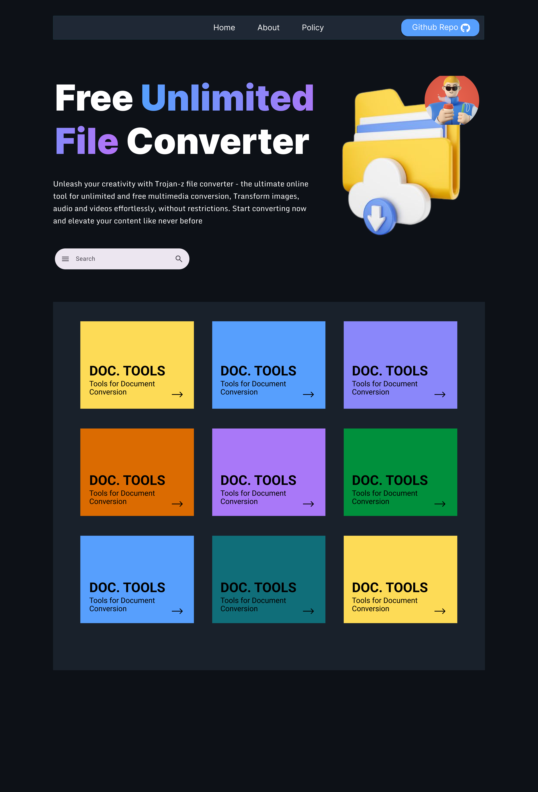
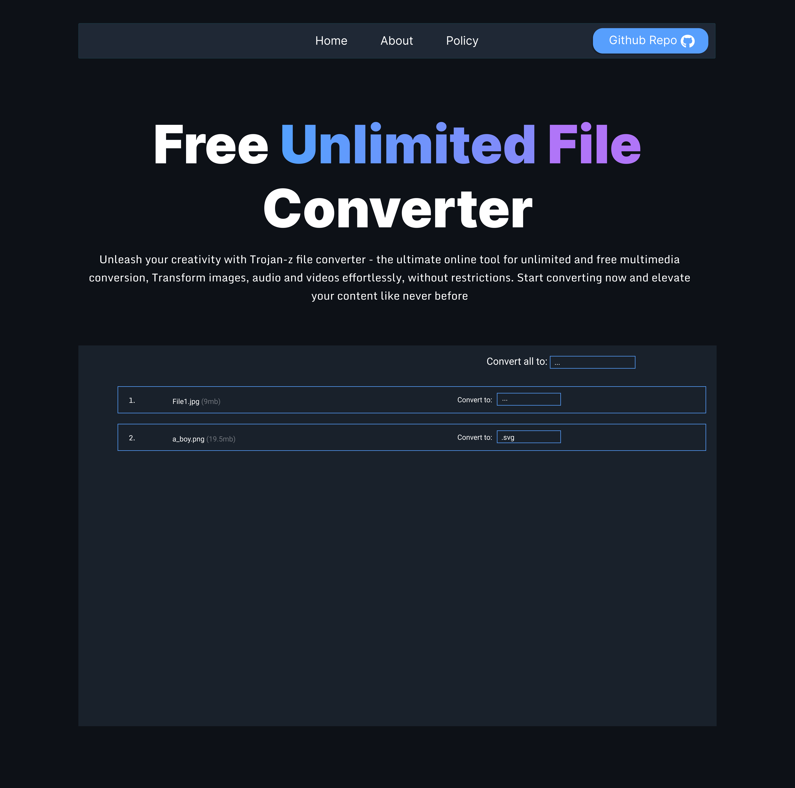
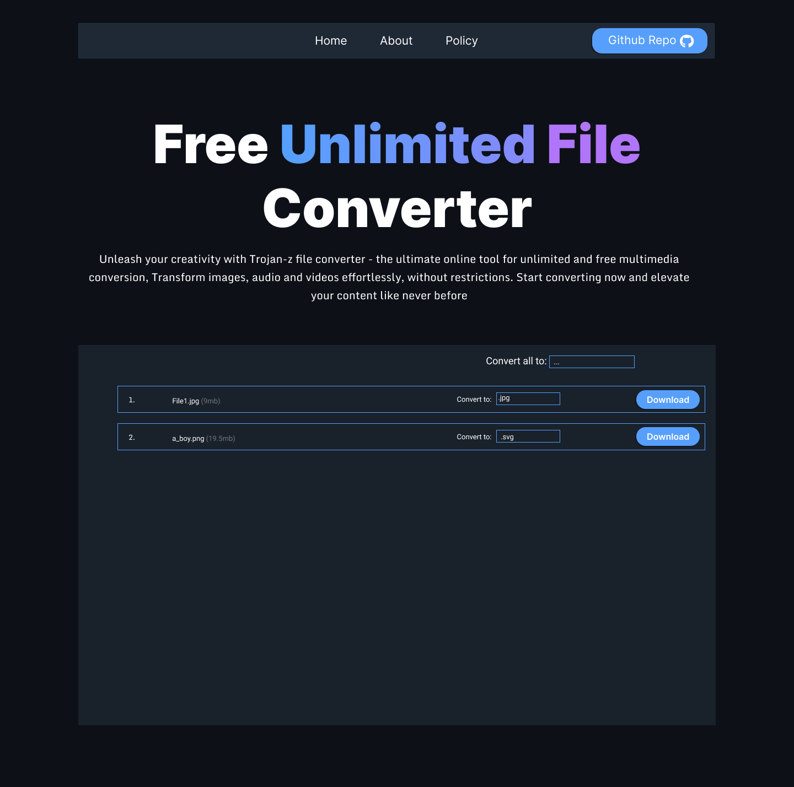

# Universal File Converter
> A multi-purpose file conversion tool: **processing...**

## 🎯 Purpose

This tool aims to simplify the file conversion process by providing a unified interface for converting between various file formats. Instead of using multiple tools or online services (which might compromise data security), users can perform all their conversion needs through a single, secure, machine-running application.

## 🔑 Key Features

### Document Conversions
- **Text/Documents**
- Word (.docx, .doc) ↔ PDF
- PDF → Text
- Text → PDF
- RTF → PDF/Word
- Markdown → HTML/PDF/Word
- HTML → PDF/Word
- OpenDocument (.odt) → PDF/Word
- Pages → PDF/Word
- LaTeX → PDF
- EPUB → PDF/Word

### Spreadsheet Conversions
- Excel (.xlsx, .xls) → PDF
- CSV ↔ Excel
- Google Sheets → Excel/PDF
- Numbers → Excel/PDF

### Presentation Conversions
- PowerPoint ↔ PDF
- Keynote → PowerPoint/PDF
- Google Slides → PowerPoint/PDF

## Media Conversions

#### Audio
- Video → Audio (MP4 → MP3)
- WAV ↔ MP3/AAC/OGG/FLAC
- M4A → MP3/WAV
- AIFF → MP3/WAV
- Voice recordings → Text (Speech-to-text)

#### Video
- Format conversions between MP4, AVI, MOV, WMV
- WebM → MP4/AVI
- FLV → MP4
- Video → GIF
- Video compression and resolution adjustment

#### Images
- Format conversions between JPG, PNG, WebP, TIFF, BMP
- HEIC → JPG/PNG
- RAW formats (CR2, NEF) → JPG/PNG
- SVG → PNG/JPG
- PSD → JPG/PNG
- Image compression and resolution adjustment

### Archive/Compression
- Conversions between ZIP, RAR, 7Z, TAR, GZ

### Development Formats
- JSON ↔ XML/YAML/CSV
- SQLite → CSV/Excel
- Various database format conversions

### Font Conversions
- TTF ↔ OTF/WOFF/WOFF2
- Type1 → TTF/OTF

## 🛠 Technical Implementation

### Backend Technology
The tool is built using Python, leveraging its robust ecosystem of libraries and compacting its feature to FASTAPI for quick integration to give quick access and usability across all platform.:

- **Document Processing**: 
  - `python-docx` for Word documents
  - `PyPDF2` for PDF operations
  - `pandoc` for universal document conversion
  - `markdown` for Markdown processing

- **Spreadsheet Handling**:
  - `openpyxl` for Excel files
  - `pandas` for CSV and data manipulation

- **Media Processing**:
  - `ffmpeg-python` for video/audio conversions
  - `Pillow` for image processing
  - `speech_recognition` for speech-to-text

- **Archive Operations**:
  - `zipfile` for ZIP operations
  - `py7zr` for 7Z files
  - `rarfile` for RAR operations

- **Development Formats**:
  - `json`, `xml`, `yaml` libraries
  - `sqlite3` for database operations

### Frontend Technology
The tool User Interface is built using React, which sits on web for global access, the interface pose as a simple experience for every user.

## 🚀 Getting Started
Visit: 

## 📋 Requirements
- Python 3.8+
- FFmpeg (for media conversions)
- Ghostscript (for PDF operations)
- Additional system libraries based on conversion types
- Node for React (for user experience)

## 📋 Screenshots
Expected User Interface

| Screens | Description |
|--|--|
|  | screen-description and usage |
|  | screen-description and usage |
|  | screen-description and usage |
|  | screen-description and usage |
|  | screen-description and usage |

> do not forget to add image after contributing to the frontend

## 🔒 Security Features
- Local processing only - data is not stored but processed on the fly.
- File integrity verification
- Safe handling of large files
- Input validation and sanitization

## 🤝 Contributing
Contributions are welcome! Please read our contributing guidelines and submit pull requests to our repository.
Make sure to push to a seperate branch if the contribution is new. 

## ⚠️ NOTE 
We do intend to build the whole features listed above in time, built and unbuilt features will be tagged with ✅ and ⌛ respectively, feel free to add feature as long as it follows the guide lines. Thank you for your contributions.

This application is under development.

Report any bugs here: --

visit -- to contact the authors.
